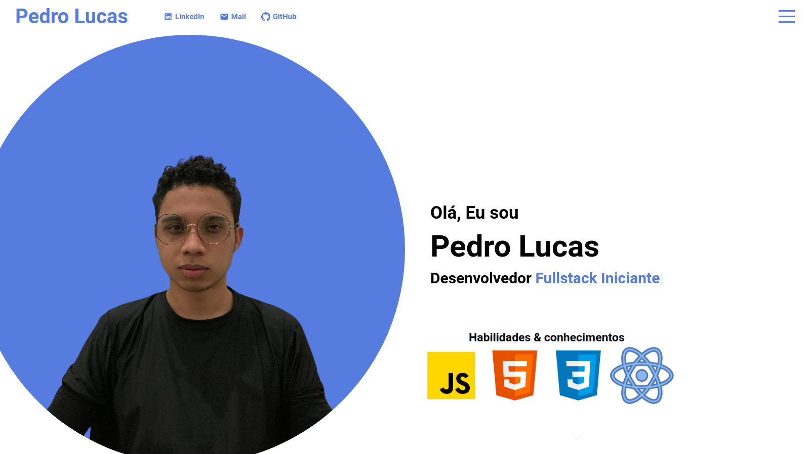

# Meu Portfolio
 
Portifólio criado para aplicar um pouco dos meus conhecimentos em reactJS. Esse será meu portfolio, tenho como objetivo de exibir e orgnizar meus projetos.  
<p align="center"></p>

## Tecnologias utilizadas:

[](https://github.com/pedrolucazx)
[](https://github.com/pedrolucazx)
[](https://github.com/pedrolucazx)

## Como rodar o projeto:

```
$ git clone https://github.com/pedrolucazx/React-Portfolio.git

$ cd React-Portfolio

# Instalação das dependências

$ yarn

# Iniciar projeto

$ yarn start
```